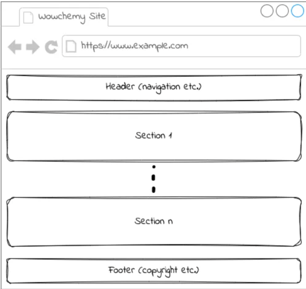

# Danny 博客

## 基本知识

### Front-matter 前言

[**Front-matter**](https://docs.hugoblox.com/reference/front-matter/) 是 markdown 文件最上方以 --- 分隔的区域，用于指定个别markdown的变量。

```markdown
---
title: Blogging Like a Hacker
lang: en-US
---
```

### page bundle: https://gohugo.io/content-management/page-bundles/

```shell
# this site has an “about” page and a “privacy” page:
content/
├── about/ # 这个是 page bundle 
│   ├── index.md
│   └── welcome.jpg
└── privacy.md
```


## 配置

[站点目录结构](https://docs.hugoblox.com/reference/site-structure/)

```shell
$ tree -L 2 .
.
├── LICENSE.md
├── README.md
├── assets
│   └── media
├── config
│   └── _default
├── content
│   ├── _index.md
│   ├── authors
│   ├── en
│   ├── golang
│   ├── kubernetes
│   ├── post
│   ├── security
│   ├── tags
│   ├── uses.md
│   └── zh
├── go.mod # 升级使用
├── go.sum
├── hugo_stats.json
├── netlify.toml
├── notebooks
│   └── blog-with-jupyter.ipynb
├ # ...
├── resources
│   └── _gen
└── static
    └── uploads # 阅读者可以下载的文件

```


### 配置文件

> The root configuration keys are build, caches, cascade, deployment, frontmatter, imaging, languages, markup, mediatypes,
menus, minify, module, outputformats, outputs, params, permalinks, privacy, related, security, segments, server, services, sitemap, and taxonomies.


### 索引页面: _index.md

_index.md索引页面在Hugo内容中是个特殊角色。它允许您在列表模板中添加前置设置和内容。
这些列表模板包括区块模板, tag模板,tag列表模板和您的主页模板。


### 菜单 menu

3 种方式

- 自动定义
- 在 front matter 正文区域
- In site configuration


## markdown 使用: https://docs.hugoblox.com/reference/markdown/


### 图片处理

- 全局资源是位于 assets 目录中或装载到 assets 目录中任意目录中的文件,这里是 assets/media/
- 页面资源是页面束（page bundle）中的文件。


1. 使用 [shortcodes](https://gohugo.io/content-management/shortcodes/#figure)
```markdown

```

2. 引用全局资源


## 命令使用


```shell
# hugo 版本
✗ hugo version
hugo v0.139.0+extended+withdeploy darwin/arm64 BuildDate=2024-11-18T16:17:45Z VendorInfo=brew
```

### 添加内容
```shell
✗ hugo new content content/kubernetes/workqueue/index.md
```


### 本地调试

```shell
✗ hugo server --minify --buildDrafts
```


### 发布

实际提交代码触发 GitHub Actions


## 升级 Hugo Themes or Plugins

插件当前在单独的文件 config/_default/module.yaml 

1. 更改 go.mod 版本
```shell
hugo mod get -u github.com/HugoBlox/hugo-blox-builder/modules/blox-tailwind@v0.3.1
```
2. 更改 github 流水线 WC_HUGO_VERSION 兼容版本


## 扩展:https://docs.hugoblox.com/reference/extend/


## 参考
- [Hugo Academic Blog Theme 本文采用的模版](https://github.com/HugoBlox/theme-blog)
- [hugoblox 文档](https://docs.hugoblox.com/)
- [hugo 官方中文文档](https://hugo.opendocs.io/content-management/)
- [hugo 官方英文文档](https://gohugo.io/documentation/)


