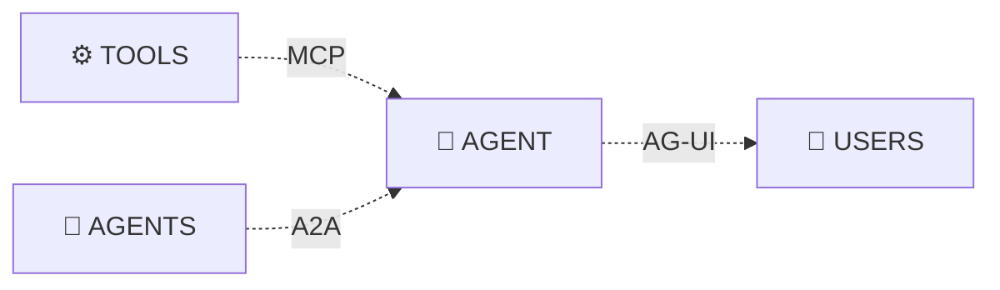

## The Agent Protocol Stack

AG-UI 与 A2A (Agent-to-Agent) 和 MCP (Model Context Protocol) 形成互补，共同构成了 Agent 协议栈：

## 事件机制

- 生命周期事件（如 RUN_STARTED, RUN_FINISHED），监控Agent运行进度。

- 文本消息事件（如 TEXT_MESSAGE_START, TEXT_MESSAGE_CONTENT, TEXT_MESSAGE_END），处理文本流式内容的事件

- 工具调用事件（如 TOOL_CALL_START, TOOL_CALL_ARGS, TOOL_CALL_END），管理 Agent 对工具的执行。

- 状态管理事件（如 STATE_SNAPSHOT, STATE_DELTA），同步 Agent 和 UI 之间的状态。

- 特殊事件（如 RAW, CUSTOM）

## 参考

