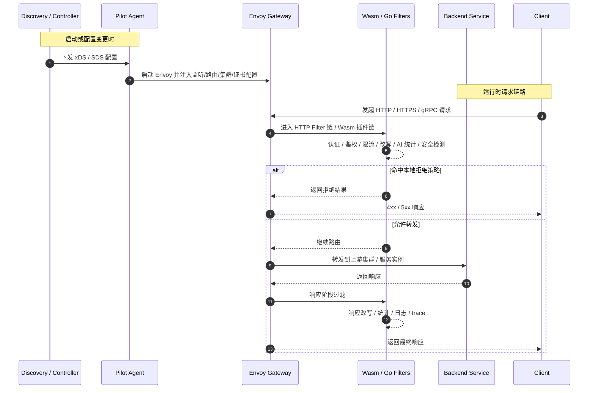

## 背景

与典型的短时、无状态 Web 请求不同，LLM 推理会话通常是长时运行、资源密集且部分有状态的。

### AI 应用三个显著的技术特征

1. 长连接
- 大量使用 WebSocket 和 SSE 等长连接协议
- 网关配置更新时需要保持连接稳定
- 必须确保业务连续性不受影响


2. 高延时
- LLM 推理响应时间远高于传统应用
- 容易受到慢速请求和并发攻击的影响
- 面临着攻击成本低但防御成本高的安全挑战


3. 大带宽
- LLM 上下文传输需要大量带宽
- 高延时场景下带宽消耗倍增
- 需要高效的流式处理能力
- 必须做好内存管理以防止系统崩溃

## 基本知识

### wasm( WebAssembly ) 

Wasm 可以理解为是一种轻量级的编码格式，它可以由多种语言编写的程序编译而来。
最初 Wasm 是用于 Web 浏览器中，为了解决前端 JS 性能不足而发明的，但是在后面逐渐扩展到了后端以及云原生等多个领域。


Proxy-Wasm 规范允许在每个 VM 中配置多个插件。因此一个 VM 可以被多个插件共同使用。
Envoy 中有三种类型插件：Http Filter、Network Filter  和  Wasm Service。

- Http Filter  是一种处理 Http 协议的插件，例如操作 Http 请求头、正文等。
- Network Filter  是一种处理 Tcp 协议的插件，例如操作 Tcp 数据帧、连接建立等。
- Wasm Service  是在单例 VM 中运行的插件类型（即在 Envoy 主线程中只有一个实例）。它主要用于执行与  Network Filter  或  Http Filter  并行的一些额外工作，如聚合指标、日志等。这样的单例 VM 本身也被称为  Wasm Service。

## Gateway API Inference Extension  推理扩展




Gateway API Inference Extension 在现有 Gateway API 的基础上，添加了针对推理任务的专属路由能力，同时保留了 Gateways 和 HTTPRoutes 等人们熟悉的模型。


### 主要特性
Gateway API Inference Extension 提供了以下关键特性：

- 模型感知路由：与传统仅基于请求路径进行路由的方式不同，Gateway API Inference Extension 支持根据模型名称进行路由。这一能力得益于网关实现（如 Envoy Proxy）对生成式 AI 推理 API 规范（如 OpenAI API）的支持。该模型感知路由能力同样适用于基于 LoRA（Low-Rank Adaptation）微调的模型。
- 服务优先级：Gateway API Inference Extension 支持为模型指定服务优先级。例如，可为在线对话类任务（对延迟较为敏感）的模型设定更高的 criticality，而对延迟容忍度更高的任务（如摘要生成）的模型则设定较低的优先级。
- 模型版本发布：Gateway API Inference Extension 支持基于模型名称进行流量拆分，从而实现模型版本的渐进式发布与灰度上线。
- 推理服务的可扩展性：Gateway API Inference Extension 定义了一种可扩展模式，允许用户根据自身需求扩展推理服务，实现定制化的路由能力，以应对默认方案无法满足的场景。
- 面向推理的可定制负载均衡：Gateway API Inference Extension 提供了一种专为推理优化的可定制负载均衡与请求路由模式，并在实现中提供了基于模型服务器实时指标的模型端点选择（model endpoint picking）机制。该机制可替代传统负载均衡方式，被称为“模型服务器感知”的智能负载均衡。实践表明，它能够有效降低推理延迟并提升集群中 GPU 的利用率

### 核心 CRD
Gateway API Inference Extension 定义了两个核心 CRD：InferencePool 和 InferenceModel。


## 第三方实现

### higress
https://github.com/alibaba/higress/blob/1bcef0c00c4d14b2af42921de2e955600b91fda2/docs/architecture.md



首先对于长连接的问题，Higress 的内核是基于 envoy 和 istio 的，实现了连接无损的热更新，可以避免类似 nginx 等网关变更配置时需要 reload，导致连接断开。

对于高延时带来的安全问题，Higress 提供了 IP/Cookie 等多维度的 CC 防护能力，面向 AI 场景，除了 QPS，还支持面向 Token 吞吐的限流防护。

对于大带宽的问题，解决方案是流式输出。因此 Higress 也支持了完全流式转发，并且数据面是基于 C++ 编写的 Envoy，在大带宽场景下，所需的内存占用极低。

```mermaid
flowchart LR
    subgraph Clients[调用方]
        A[浏览器 / App / AI Agent / MCP Client]
    end

    subgraph Gateway[Higress Gateway]
        B1[Pilot Agent]
        B2[Envoy]
        B3[Wasm Plugins\nplugins/wasm-go/extensions]
        B4[Go Filters\nplugins/golang-filter]
        B5[MCP Session Filter\nplugins/golang-filter/mcp-session]
        B6[MCP Server Filter\nplugins/golang-filter/mcp-server]
    end

    subgraph Control[控制面下发]
        C1[xDS from Discovery]
        C2[EnvoyFilter / WasmPlugin]
        C3[MCP 路由配置\npkg/ingress/kube/configmap + pkg/ingress/kube/mcpserver]
    end

    subgraph MCPBackends[MCP 后端]
        D1[托管型 MCP Server\nplugins/wasm-go/mcp-servers]
        D2[远程 MCP Server]
        D3[OpenAPI 转 MCP]
        D4[注册中心发现的 MCP Server\nregistry/nacos/mcpserver]
    end

    subgraph Biz[普通后端]
        E1[HTTP / gRPC / Dubbo / 微服务]
        E2[LLM Provider / AI Service]
    end

    A --> B2
    B1 --> B2
    C1 --> B1
    C2 --> B2
    C3 --> B5
    C3 --> B6

    B3 --> B2
    B4 --> B2
    B5 --> B2
    B6 --> B2

    B2 --> D1
    B2 --> D2
    B2 --> D3
    B2 --> D4
    B2 --> E1
    B2 --> E2

```



生命周期


#### WasmPlugin


```shell
 ~ kubectl get WasmPlugin -n higress-system
NAME                    AGE
custom-response-1.0.0   2d15h
ext-auth-1.0.0          2d18h
key-auth.internal       9d
mcp-server-1.0.0        2d19h
mcp-server.internal     9d
```

## 参考

- https://gateway-api-inference-extension.sigs.k8s.io/
- [Bringing AI-Aware Traffic Management to Istio: Gateway API Inference Extension Support](https://istio.io/latest/blog/2025/inference-extension-support/)
- [为 Kubernetes 提供智能的 LLM 推理路由：Gateway API Inference Extension 深度解析](https://cloud.tencent.com/developer/article/2522826)