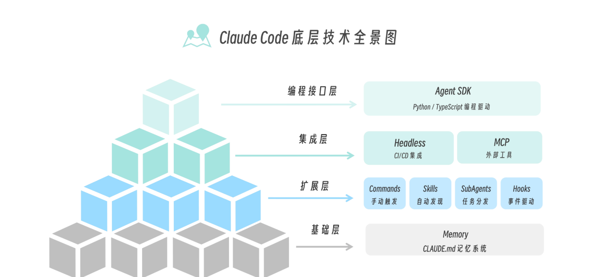

## 底层技术全景图




### 基础层：Memory（记忆系统）

基础层也可以称为是 Claude Code 的长期记忆系统，它的核心文件是 CLAUDE.md

### 四大核心组件

Commands（斜杠命令）、Skills（技能）、SubAgents（子代理）、Hooks（钩子）四个核心组件


### 集成层：连接外部世界上面这四大核心组件之上，是集成层，负责链接外部世界。

集成层包含 Headless（无头模式）和 MCP（Model Context Protocol）两大技术。


### Plugins：打包容器
当你开发了一套好用的 Commands、Skills、Hooks 组合，想要分享给团队或社区时，就需要 Plugins

## 常见工作流

https://code.claude.com/docs/en/common-workflows

### 1. 图片处理

mac 使用 ctrl+v 粘贴


### 2. 引用文件或则目录
```shell
@文件路径
```

### 3. 恢复会话

```shell
> /resume
───────────────────────────────────────────────────────────────────────────────────────────────────────────────────────────────────────────────────────────────────

Resume Session
╭─────────────────────────────────────────────────────────────────────────────────────────────────────────────────────────────────────────────────────────────────╮
│ ⌕ Search…                                                                                                                                                       │
╰─────────────────────────────────────────────────────────────────────────────────────────────────────────────────────────────────────────────────────────────────╯

❯ 我这个图片是在干嘛
  22 minutes ago · 2 messages · -

  @/tmp/nacos.yaml 读取配置
  1 week ago · 14 messages · -
```


### 4. mcp 

```json
{
  "mcpServers": {
    "github": {
      "type": "http",
      "url": "https://api.githubcopilot.com/mcp/",
      "headers": {
        "Authorization": "Bearer ${GITHUB_TOKEN}"
      }
    },
    "kubernetes": {
      "command": "npx",
      "args": [
        "-y",
        "kubernetes-mcp-server@v0.0.57"
      ]
    }
  }
}
```

```shell
> /mcp
───────────────────────────────────────────────────────────────────────────────────────────────────────────────────────────────────────────────────────────────────
 Manage MCP servers
 5 servers

 ❯ 1. argocd-mcp            ✔ connected · Enter to view details
   2. gitlab                ✔ connected · Enter to view details
   3. kubernetes            ✔ connected · Enter to view details
   4. mcp-server-nacos      ◯ disabled · Enter to view details
   5. plugin:gitlab:gitlab  ◯ disabled · Enter to view details
   
   
│ Kubernetes MCP Server                                                                                                                                           │
│                                                                                                                                                                 │
│ Status: ✔ connected                                                                                                                                             │
│ Command: npx                                                                                                                                                    │
│ Args: -y kubernetes-mcp-server@v0.0.57                                                                                                                          │
│ Config location: /Users/python/.claude.json                                                                                                                     │
│ Capabilities: tools · prompts                                                                                                                                   │
│ Tools: 23 tools                                                                                                                                                 │
│                                                                                                                                                                 │
│ ❯ 1. View tools                                                                                                                                                 │
│   2. Reconnect                                                                                                                                                  │
│   3. Disable
```


### 5 Headless模式
将AI能力集成到脚本与CI

```shell
# 场景：快速根据获取一个Git Commit Message建议
claude -p "Stage我的修改，然后生成一条符合Conventional Commit规范的Message" --allowedTools "Bash,Read" --permission-mode acceptEdits


# 使用cat将文件内容通过管道传递给claude
cat nginx-error.log | claude -p "请分析这份Nginx错误日志，总结出最主要的错误类型和可能的原因。"


# 实时观察AI的思考过程
claude -p "使用go-code-security-reviewer subagent 审查@internal/converter/converter.go，检查是否有安全漏洞" --output-format stream-json --verbose
```

## 规范驱动开发（Spec-Driven Development, SDD）


## 参考
- [极客时间: Claude Code 工程化实践](https://time.geekbang.org/column/article/942438)
- [AI 原生开发工作流实战](https://time.geekbang.org/column/article/924983)

