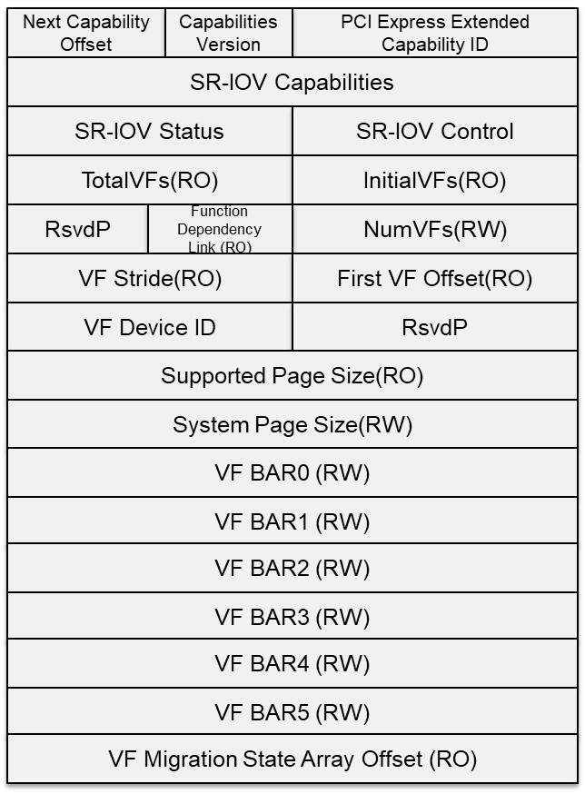

SR-IOV（Single Root I/O Virtualization）是一个将 PCIe（Peripheral Component Interconnect Express，快速外设组件互连）共享给虚拟机的标准，通过为虚拟机提供独立的内存空间、中断、DMA流，来绕过VMM实现数据访问。
SR-IOV基于两种PCIe functions.

- PF (Physical Function)：包含完整的PCIe功能，包括SR-IOV的扩张能力，该功能用于SR-IOV的配置和管理。
- VF (Virtual Function)：包含轻量级的PCIe功能。每一个VF有它自己独享的PCI配置区域，并且可能与其他VF共享着同一个物理资源. 以Intel 10GE网卡82599为例，PF驱动是标准的ixgbe，VF驱动是ixgbevf。
尽管单个PF理论上可以生成65536个VF，但实际数量受到硬件资源限制，例如82599支持64个VF。


## SR-IOV 优点
性能提升: SR-IOV通过硬件辅助实现虚拟化，VF可以绕过宿主机直接与硬件交互，减少了数据包处理的延迟，提供了接近原生的性能。

资源利用率: SR-IOV设备能够高效利用物理设备资源，每个VF都有自己的硬件资源，提高了整体资源利用率。

隔离性: 每个VF都是独立的，互不干扰，提高了系统的安全性和稳定性。

可扩展性: 支持更多的虚拟机同时运行，而不会显著降低性能，使其适用于大型虚拟化环境。


## SR-IOV 缺点
- VF数量有限
- ring 结构对于每个 vendor 的 NIC 来说都是独有的。同时，不同 NIC 的配置和控制各不相同，以及对每个 VF 缺少统一的配置、可选项。正是因为这些限制，VFs 需要部署在特定的裸金属服务器上，也就意味着 VNFs 在 host 之间的迁移不是那么容易的。


## 基本知识

### PCI(Peripheral Component Interconnect 外围设备互联)


Intel在1992年提出PCI（Peripheral Component Interconnect）总线协议,PCI是一种外设总线规范。
总线：总线是一种传输信号的路径或信道。典型情况是，总线是连接于一个或多个导体的电气连线，总线上连接的全部设备可在同一时间收到全部的传输内容。
总线由电气接口和编程接口组成。

Linux PCI设备驱动实际包括Linux PCI设备驱动和设备本身驱动两部分。
PCI有三种地址空间：PCI I/O空间、PCI内存地址空间和PCI配置空间。
其中，PCI I/O空间和PCI内存地址空间由设备驱动程序使用，而PCI配置空间由Linux PCI初始化代码使用，用于配置PCI设备，比如中断号以及I/O或内存基地址。

/proc/iomem 描写叙述了系统中全部的设备I/O在内存地址空间上的映射。

一个PCI设备 40000000-400003ff : 0000:00:1f.1 解释
* 40000000-400003ff是它所映射的内存地址空间，占领了内存地址空间的1024 bytes的位置，而
* 0000:00:1f.1 则是一个PCI外设的地址,它以冒号和逗号分隔为4个部分，第一个16位表示域，第二个8位表示一个总线编号，第三个5位表示一 个设备号，最后是3位，表示功能号.PCI设备的地址格式为<总线号>:<插槽号>.<功能号>


一般一类设备在出厂的时候会有相同的一串classid,而classid记录在/sys/bus/pci/devices/*/class文件中


```shell
# lspci help
Usage: lspci [<switches>]

Basic display modes:
-mm             Produce machine-readable output (single -m for an obsolete format)
-t              Show bus tree

Display options:
-v              Be verbose (-vv or -vvv for higher verbosity)
-k              Show kernel drivers handling each device
-x              Show hex-dump of the standard part of the config space
-xxx            Show hex-dump of the whole config space (dangerous; root only)
-xxxx           Show hex-dump of the 4096-byte extended config space (root only)
-b              Bus-centric view (addresses and IRQ's as seen by the bus)
-D              Always show domain numbers
-P              Display bridge path in addition to bus and device number
-PP             Display bus path in addition to bus and device number

Resolving of device ID's to names:
-n              Show numeric ID's 
-nn             Show both textual and numeric ID's (names & numbers)
-q              Query the PCI ID database for unknown ID's via DNS
-qq             As above, but re-query locally cached entries
-Q              Query the PCI ID database for all ID's via DNS

Selection of devices:
-s [[[[<domain>]:]<bus>]:][<slot>][.[<func>]]   Show only devices in selected slots
-d [<vendor>]:[<device>][:<class>]              Show only devices with specified ID's

Other options:
-i <file>       Use specified ID database instead of /usr/share/hwdata/pci.ids
-p <file>       Look up kernel modules in a given file instead of default modules.pcimap
-M              Enable `bus mapping' mode (dangerous; root only)

PCI access options:
-A <method>     Use the specified PCI access method (see `-A help' for a list)
-O <par>=<val>  Set PCI access parameter (see `-O help' for a list)
-G              Enable PCI access debugging
-F <file>       Read PCI configuration dump from a given file
```


#### PCI总线缺陷

(1)由于采用了基于总线的共享传输模式，在PCI总线上不可能同时传送两组以上的数据，当一个PCI设备占用总线时，其他设备只能等待；

(2)随着总线频率从33MHz提高到66MHz，甚至133MHz（PCI-X），信号线之间的相互干扰变得越来越严重，在一块主板上布设多条总线的难度也就越来越大；

(3)由于PCI设备采用了内存映射I/O地址的方式建立与内存的联系，热添加PCI设备变成了一件非常困难的工作。目前的做法是在内存中为每一个PCI设备划出一块50M到100M的区域，这段空间用户是不能使用的，因此如果一块主板上支持的热插拔PCI接口越多，用户损失的内存就越多；

(4)PCI的总线上虽然有buffer作为数据的缓冲区，但是它不具备纠错的功能，如果在传输的过程中发生了数据丢失或损坏的情况，控制器只能触发一个NMI中断通知操作系统在PCI总线上发生了错误


### PCIe(Peripheral Component Interconnect Express)


一种用于连接外设的总线。它于2003年提出来，作为替代PCI和PCI-X (Peripheral Component Interconnect eXtended)的方案，现在已经成了现代CPU和其他几乎所有外设交互的标准或者基石.

PCIe和PCI最大的改变是由并行改为串行，通过使用差分信号传输（differential transmission）.

比如，我们马上能想到的GPU，网卡，USB控制器，声卡，网卡等等，这些都是通过PCIe总线进行连接的，然后现在非常常见的基于m.2接口的SSD，也是使用NVMe协议，通过PCIe总线进行连接的，
除此以外，Thunderbolt 3 ，USB4，甚至最新的CXL互联协议 ，都是基于PCIe的！


### NVMe(Non-Volatile Memory Express)
或称非易失性内存主机控制器接口规范（Non Volatile Memory Host Controller Interface Specification，缩写：NVMHCIS）是一个逻辑设备接口规范。
它是与Advanced Host Controller Interface(AHCI)类似的、基于设备逻辑接口的总线传输协议规范（相当于通讯协议中的应用层），用于访问通过PCI Express（PCIe）总线附加的非易失性存储器介质（例如采用闪存的固态硬盘驱动器），虽然理论上不一定要求 PCIe 总线协议.
这个协议就好比SAS（串行SCSI)和SATA一样，用于定义硬件接口和传输协议。

接口：也就是设备如何与计算机通信。常见的存储设备接口包括：


- SATA接口，通常用于2.5寸和3.5寸硬盘，有时候一些M.2设备也会使用

- PCI Express(PCIe)接口， 用于M.2和PCIe设备

协议：定义了如何在计算机与设备之间传输数据。常见的协议包括：

- 用于SATA接口的AHCI或者ATA协议

- 用于PCIe接口的NVMe协议

在SATA中计算机与存储设备只能有一个队列，即使是多CPU情况下，所有请求只能经过这样一个狭窄的道路。
而NVMe协议可以最多有64K个队列，每个CPU或者核心都可以有一个队列，这样并发程度大大提升，性能也自然更高了。


#### nvme-cli 命令

```shell
# 安装
$ yum install nvme-cli

[root@master-01 ~]# nvme
nvme-1.8.1
usage: nvme <command> [<device>] [<args>]

The '<device>' may be either an NVMe character device (ex: /dev/nvme0) or an
nvme block device (ex: /dev/nvme0n1).

The following are all implemented sub-commands:
  list                  List all NVMe devices and namespaces on machine
  list-subsys           List nvme subsystems
  id-ctrl               Send NVMe Identify Controller
  id-ns                 Send NVMe Identify Namespace, display structure
  list-ns               Send NVMe Identify List, display structure
  ns-descs              Send NVMe Namespace Descriptor List, display structure
  id-nvmset             Send NVMe Identify NVM Set List, display structure
  create-ns             Creates a namespace with the provided parameters
  delete-ns             Deletes a namespace from the controller
  attach-ns             Attaches a namespace to requested controller(s)
  detach-ns             Detaches a namespace from requested controller(s)
  list-ctrl             Send NVMe Identify Controller List, display structure
  get-ns-id             Retrieve the namespace ID of opened block device
  get-log               Generic NVMe get log, returns log in raw format
  telemetry-log         Retrieve FW Telemetry log write to file
  fw-log                Retrieve FW Log, show it
  changed-ns-list-log   Retrieve Changed Namespace List, show it
  smart-log             Retrieve SMART Log, show it
  ana-log               Retrieve ANA Log, show it
  error-log             Retrieve Error Log, show it
  effects-log           Retrieve Command Effects Log, show it
  endurance-log         Retrieve Endurance Group Log, show it
  get-feature           Get feature and show the resulting value
  device-self-test      Perform the necessary tests to observe the performance
  self-test-log         Retrieve the SELF-TEST Log, show it
  set-feature           Set a feature and show the resulting value
  set-property          Set a property and show the resulting value
  get-property          Get a property and show the resulting value
  format                Format namespace with new block format
  fw-commit             Verify and commit firmware to a specific slot (fw-activate in old version < 1.2)
  fw-download           Download new firmware
  admin-passthru        Submit an arbitrary admin command, return results
  io-passthru           Submit an arbitrary IO command, return results
  security-send         Submit a Security Send command, return results
  security-recv         Submit a Security Receive command, return results
  resv-acquire          Submit a Reservation Acquire, return results
  resv-register         Submit a Reservation Register, return results
  resv-release          Submit a Reservation Release, return results
  resv-report           Submit a Reservation Report, return results
  dsm                   Submit a Data Set Management command, return results
  flush                 Submit a Flush command, return results
  compare               Submit a Compare command, return results
  read                  Submit a read command, return results
  write                 Submit a write command, return results
  write-zeroes          Submit a write zeroes command, return results
  write-uncor           Submit a write uncorrectable command, return results
  sanitize              Submit a sanitize command
  sanitize-log          Retrieve sanitize log, show it
  reset                 Resets the controller
  subsystem-reset       Resets the subsystem
  ns-rescan             Rescans the NVME namespaces
  show-regs             Shows the controller registers or properties. Requires character device
  discover              Discover NVMeoF subsystems
  connect-all           Discover and Connect to NVMeoF subsystems
  connect               Connect to NVMeoF subsystem
  disconnect            Disconnect from NVMeoF subsystem
  disconnect-all        Disconnect from all connected NVMeoF subsystems
  gen-hostnqn           Generate NVMeoF host NQN
  dir-receive           Submit a Directive Receive command, return results
  dir-send              Submit a Directive Send command, return results
  virt-mgmt             Manage Flexible Resources between Primary and Secondary Controller
  version               Shows the program version
  help                  Display this help

See 'nvme help <command>' for more information on a specific command

The following are all installed plugin extensions:
  intel           Intel vendor specific extensions
  lnvm            LightNVM specific extensions
  memblaze        Memblaze vendor specific extensions
  wdc             Western Digital vendor specific extensions
  huawei          Huawei vendor specific extensions
  netapp          NetApp vendor specific extensions
  toshiba         Toshiba NVME plugin
  micron          Micron vendor specific extensions
  seagate         Seagate vendor specific extensions

# 列出系统所有NVMe SSD:设备名,序列号,型号,namespace,使用量,LBA格式,firmware版本
$ nvme list
Node          SN              Model                       Namespace Usage                  Format          FW Rev  
------------- --------------- --------------------------- --------- ---------------------- --------------- --------
/dev/nvme0n1  S676NF0R908202  SAMSUNG MZVL21T0HCLR-00B00  1         0.00   B /   1.02  TB  512   B +  0 B  GXA7401Q
/dev/nvme1n1  S676NF0R908214  SAMSUNG MZVL21T0HCLR-00B00  1         0.00   B /   1.02  TB  512   B +  0 B  GXA7401Q
/dev/nvme2n1  S676NF0R908144  SAMSUNG MZVL21T0HCLR-00B00  1         0.00   B /   1.02  TB  512   B +  0 B  GXA7401Q
```


### Modalias
Modalias 是 Linux 内核用来识别硬件设备的一种机制。在 Linux 内核中，硬件设备驱动程序需要能够识别并与之交互的硬件设备。
Modalias 字符串包含了设备的基本信息，如设备类型、制造商 ID、设备 ID 等，这些信息被内核用来匹配相应的驱动程
```shell
# pci 表示设备遵循 PCI 总线标准，后面的键值对分别表示供应商 ID（vender ID）、设备 ID、子供应商 ID（sub-vendor ID）、子设备 ID（sub-device ID）和设备序列号。
[root@master-01 ~]# cat /sys/devices/pci0000:00/0000:00:00.0/modalias
pci:v00008086d00007190sv000015ADsd00001976bc06sc00i00
```
Modalias 的主要作用是在内核初始化过程中，帮助内核识别新检测到的硬件设备，并找到与之匹配的驱动程序。
当内核发现一个新设备时，它会尝试读取设备的 Modalias 属性，然后通过内核的驱动模型来查找匹配的驱动程序。如果找到了匹配的驱动程序，内核将加载该驱动程序，并允许它管理新检测到的设备。

### /sys/bus/pci/devices 目录介绍
```shell
# /sys/class目录下 net/scsi_host/fc_host/infiband_host 等 是/sys/bus/pci/devices/*/class下面pci设备的映射，映射到它们指定的类型中
[root@master-01 ~]# ls /sys/class/
ata_device  block        dmi             hidraw       iommu     msr            power_supply  scsi_device   thermal  usbmon
ata_link    bsg          drm             hmm_device   leds      net            ppdev         scsi_disk     tpm      vc
ata_port    cpuid        drm_dp_aux_dev  hwmon        mdio_bus  pci_bus        pwm           scsi_generic  tpmrm    vtconsole
backlight   devcoredump  gpio            i2c-adapter  mem       pcmcia_socket  raw           scsi_host     tty      watchdog
bdi         dma          graphics        input        misc      powercap       rtc           spi_master    typec
```


- /sys/class/net/< device name >/device/sriov_numvfs 参数设置了 SR-IOV 网络设备VF数量


### /etc/sysconfig/netwrok-scripts/ 目录介绍

与网络接口配置相关的文件，以及控制网络接口状态的脚本文件，全都位于 /etc/sysconfig/netwrok-scripts/ 目录下。
网络接口配置文件用于控制系统中的软件网络接口，并通过这些接口实现对网络设备的控制。
当系统启动时，系统通过这些接口配置文件决定启动哪些接口，以及如何对这些接口进行配置。接口配置文件的名称通常类似于 ifcfg-，其中 与配置文件所控制的设备的名称相关。 
在所有的网络接口中，最常用的就是以太网接口ifcfg-eth0，它是系统中第一块网卡的配置文件。


### QoS(Quality of Service 服务质量)
三种服务模型：

Best-Effort service 尽力而为服务模型: 不提供任何保证

Integrated service 综合服务模型: 

Differentiated service 差分服务模型: 将网络流量分成多个类，不同类按不同优先级处理


### VLAN 优先级 priority

802.1P优先级，也叫CoS（Class of Service，服务等级）

## SR-IOV 基本操作


```shell
# 根据domain bus号等信息，查看指定pcie设备的信息，可搭配表1任意参数使用
$ lspci -s 0000:7d:00.0 -vv
7d:00.0 Ethernet controller: Huawei Technologies Co., Ltd. HNS GE/10GE/25GE RDMA Network Controller (rev 21)
        Subsystem: Huawei Technologies Co., Ltd. Device 0454
        Control: I/O- Mem+ BusMaster+ SpecCycle- MemWINV- VGASnoop- ParErr- Stepping- SERR- FastB2B- DisINTx-
        Status: Cap+ 66MHz- UDF- FastB2B- ParErr- DEVSEL=fast >TAbort- <TAbort- <MAbort- >SERR- <PERR- INTx-
        Latency: 0
        NUMA node: 0
        Region 0: Memory at 128c00000 (64-bit, prefetchable) [size=64K]
        Region 2: Memory at 120000000 (64-bit, prefetchable) [size=1M]
        Capabilities: [40] Express (v2) Endpoint, MSI 00
                DevCap: MaxPayload 128 bytes, PhantFunc 0, Latency L0s <64ns, L1 <1us
                        ExtTag+ AttnBtn- AttnInd- PwrInd- RBE+ FLReset+ SlotPowerLimit 0.000W
                DevCtl: CorrErr- NonFatalErr- FatalErr- UnsupReq-
                        RlxdOrd+ ExtTag+ PhantFunc- AuxPwr- NoSnoop- FLReset-
                        MaxPayload 128 bytes, MaxReadReq 512 bytes
                DevSta: CorrErr- NonFatalErr- FatalErr- UnsupReq- AuxPwr- TransPend-
                LnkCap: Port #0, Speed 2.5GT/s, Width x1, ASPM not supported
                        ClockPM- Surprise- LLActRep- BwNot- ASPMOptComp+
                LnkCtl: ASPM Disabled; RCB 64 bytes Disabled- CommClk-
                        ExtSynch- ClockPM- AutWidDis- BWInt- AutBWInt-
                LnkSta: Speed 2.5GT/s (ok), Width x1 (ok)
                        TrErr- Train- SlotClk- DLActive- BWMgmt- ABWMgmt-
                DevCap2: Completion Timeout: Not Supported, TimeoutDis+, NROPrPrP-, LTR-
                         10BitTagComp-, 10BitTagReq-, OBFF Not Supported, ExtFmt-, EETLPPrefix-
                         EmergencyPowerReduction Not Supported, EmergencyPowerReductionInit-
                         FRS-, TPHComp-, ExtTPHComp-
                         AtomicOpsCap: 32bit- 64bit- 128bitCAS-
                DevCtl2: Completion Timeout: 50us to 50ms, TimeoutDis-, LTR-, OBFF Disabled
                         AtomicOpsCtl: ReqEn-
                LnkCtl2: Target Link Speed: 2.5GT/s, EnterCompliance- SpeedDis-
                         Transmit Margin: Normal Operating Range, EnterModifiedCompliance- ComplianceSOS-
                         Compliance De-emphasis: -6dB
                LnkSta2: Current De-emphasis Level: -6dB, EqualizationComplete-, EqualizationPhase1-
                         EqualizationPhase2-, EqualizationPhase3-, LinkEqualizationRequest-
        Capabilities: [a0] MSI-X: Enable+ Count=131 Masked-
                Vector table: BAR=0 offset=00000000
                PBA: BAR=0 offset=00008000
        Capabilities: [b0] Power Management version 3
                Flags: PMEClk- DSI- D1- D2- AuxCurrent=0mA PME(D0-,D1-,D2-,D3hot-,D3cold-)
                Status: D0 NoSoftRst- PME-Enable- DSel=0 DScale=0 PME-
        Capabilities: [100 v1] Access Control Services
                ACSCap: SrcValid- TransBlk- ReqRedir- CmpltRedir- UpstreamFwd- EgressCtrl- DirectTrans-
                ACSCtl: SrcValid- TransBlk- ReqRedir- CmpltRedir- UpstreamFwd- EgressCtrl- DirectTrans-
        Capabilities: [200 v1] Single Root I/O Virtualization (SR-IOV)
                IOVCap: Migration-, Interrupt Message Number: 000
                IOVCtl: Enable+ Migration- Interrupt- MSE+ ARIHierarchy+
                IOVSta: Migration-
                Initial VFs: 127, Total VFs: 127, Number of VFs: 127, Function Dependency Link: 00
                VF offset: 8, stride: 1, Device ID: a22f
                Supported Page Size: 00000553, System Page Size: 00000010
                Region 0: Memory at 0000000128c10000 (64-bit, prefetchable)
                Region 2: Memory at 0000000120100000 (64-bit, prefetchable)
                VF Migration: offset: 00000000, BIR: 0
        Capabilities: [300 v1] Transaction Processing Hints
                Device specific mode supported
                No steering table available
        Capabilities: [450 v1] Alternative Routing-ID Interpretation (ARI)
                ARICap: MFVC- ACS-, Next Function: 1
                ARICtl: MFVC- ACS-, Function Group: 0
        Kernel driver in use: hns3
        Kernel modules: hclge, hns3, hns_roce_hw_v2
```
 
capacity 字段介绍
* Initial VFs - Indicates to the SR-PCIM the number of VFs that are initially associated with the PF.

* Total VFs - Indicates the maximum number of VFs that can be associated with the PF.

* Num VFs - Controls the number of VFs that are visible. Num VFs <= Initial VFs = Total VFs.


```shell
# 列出网卡
ls /sys/class/net/

eth0          eth1          bond1          lo        calixxx 
```
ethX 是真实的物理网卡，bondX 是网络绑定 (bonding) 接口，lo 是本机的 loopback 网络接口，calixxx 是网络插件 Calico 为容器提供的网络接口.


```shell
# ethtool命令用于获取以太网卡的配置信息, -i/--driver 显示网卡驱动的信息，如驱动的名称、版本等
$ ethtool -i eno49
 
driver: igb # 驱动
version: 5.6.0-k
firmware-version: 1.61, 0x80000daa, 1.949.0
expansion-rom-version:
bus-info: 0000:04:00.0 # PCI 地址
supports-statistics: yes
supports-test: yes
supports-eeprom-access: yes
supports-register-dump: yes
supports-priv-flags: yes
```


```shell
# 查看之前是否已经开启 SR-IOV
cat /sys/class/net/eth0/device/sriov_numvfs

# 开启 SR-IOV: 给网卡创建了 2 个 SR-IOV VF
echo 2 > /sys/class/net/eth0/device/sriov_numvfs

$ lspci | grep Virtual

3d:02.0 Ethernet controller: Intel Corporation Ethernet Virtual Function 700 Series (rev 09)
3d:02.1 Ethernet controller: Intel Corporation Ethernet Virtual Function 700 Series (rev 09)

# 查看网卡
ip link show eth0

4: eth0: <BROADCAST,MULTICAST> mtu 1500 qdisc noop state DOWN mode DEFAULT group default qlen 1000
    link/ether 90:f7:b2:4b:dc:3d brd ff:ff:ff:ff:ff:ff
    vf 0     link/ether 2e:3a:41:bc:02:cc brd ff:ff:ff:ff:ff:ff, spoof checking on, link-state auto, trust off
    vf 1     link/ether 5a:d4:e4:45:83:7b brd ff:ff:ff:ff:ff:ff, spoof checking on, link-state auto, trust off
    altname enp61s0f0

# 删除 SR-IOV VF
echo 0 > /sys/class/net/eth0/device/sriov_numvfs

# 查看厂商、设备 ID
$ lspci -s 0000:3d:00.0 -n
3d:00.0 0200: 8086:37d1 (rev 09) #  8086 就是厂商 ID，37d1 就是设备 ID。

```
这里需要注意VF设备是不能增量添加的，如果需要修改启动的VF数量，需要先将sriov_numvfs值重置为0后再重新设置为目标值，所以在使用SR-IOV功能最好能确定最多会使用到几个VF，以防在业务运行过程中需要扩展VF数影响正在使用VF的业务。

Linux Kernel version 3.8.x 及以上版本可以通过上述调整 sriov_numvfs 方法动态调整VF数量。
但是，对于 3.7.x 或更低版本，则不能动态调整，而是要在加载内核模块时传递参数:


开启SR-IOV功能后，在/sys/class/net/eth1/device目录下会多出多个virtfnX的目录，这些目录下分别记录了对应VF的信息，例如可以通过ls /sys/class/net/eth1/device/virtfn*/net显示对应vf设备名称.
如果VF已经被放入了其他网络名字空间，那么net目录下会显示为空，例如上图中的virtfn0。

```shell
$ ip -d link show eth4
6: eth4: <BROADCAST,MULTICAST,SLAVE,UP,LOWER_UP> mtu 1500 qdisc mq master bond0 state UP mode DEFAULT group default qlen 1000
    link/ether f0:33:e5:a3:92:81 brd ff:ff:ff:ff:ff:ff promiscuity 0 minmtu 68 maxmtu 9702 
    bond_slave state ACTIVE mii_status UP link_failure_count 0 perm_hwaddr f0:33:e5:a3:92:85 queue_id 0 ad_aggregator_id 2 ad_actor_oper_port_state 61 ad_partner_oper_port_state 61 addrgenmode none numtxqueues 2 numrxqueues 2 gso_max_size 65536 gso_max_segs 65535 
    vf 0     link/ether 00:00:00:00:00:00, spoof checking off, link-state auto, trust off
    vf 1     link/ether 00:00:00:00:00:00, spoof checking off, link-state auto, trust off
    ... 
$ ls /sys/class/net/eth4/device/virtfn*/net
/sys/class/net/eth4/device/virtfn0/net:

/sys/class/net/eth4/device/virtfn100/net:
eth235

/sys/class/net/eth4/device/virtfn101/net:
eth236

/sys/class/net/eth4/device/virtfn102/net:
eth237

/sys/class/net/eth4/device/virtfn103/net:
eth238
...
```


## 网卡绑定 bond



网卡bond，即网卡绑定。网卡绑定有多种叫法：Port Trunking, Channel Bonding, Link Aggregation, NIC teaming等等。
主要是将多个物理网卡绑定到一个逻辑网卡上。通过绑定可以达到链路冗余、带宽扩容、负载均衡等目的。
网卡bond一般主要用于网络吞吐量很大，以及对于网络稳定性要求较高的场景，是生产场景中提高性能和可靠性的一种常用技术。

多网卡绑定实际上需要提供一个额外的软件的bond驱动程序实现。通过驱动程序可以将多块网卡屏蔽。
对TCP/IP协议层只存在一个Bond网卡，在Bond程序中实现网络流量的负载均衡，即将一个网络请求重定位到不同的网卡上，来提高总体网络的可用性

怎么看当前bond的mode？
- $ cat /proc/net/bonding/bondX  其中 bondX 是网络绑定接口的名称，其中 X 是数字，表示具体的网络绑定接口编号。
- $ vim /etc/sysconfig/network-scripts/ifcfg-bond0的BONDING_OPTS参数
```shell
# 查看 bond 绑定的网卡
$ cat /proc/net/bonding/bond0 
Ethernet Channel Bonding Driver: v3.7.1 (April 27, 2011) # 显示网络绑定驱动程序的版本号

Bonding Mode: IEEE 802.3ad Dynamic link aggregation # 显示网络绑定模式，即使用的网络绑定算法
Transmit Hash Policy: layer3+4 (1)
MII Status: up # 显示网络接口的 MII 状态为上线（up）或下线（down）
MII Polling Interval (ms): 100 # 显示 MII 轮询间隔的时间（毫秒）
Up Delay (ms): 0 # 显示网络接口激活时的延迟时间（毫秒）
Down Delay (ms): 0

802.3ad info
LACP rate: slow
Min links: 0
Aggregator selection policy (ad_select): stable
System priority: 65535
System MAC address: --:--:e5:a3:92:81
Active Aggregator Info:
        Aggregator ID: 2
        Number of ports: 2
        Actor Key: 21
        Partner Key: 4353
        Partner Mac Address: --:--:59:60:10:17

Slave Interface: eth0
MII Status: up
Speed: 25000 Mbps
Duplex: full
Link Failure Count: 0
Permanent HW addr: --:--:e5:a3:92:81
Slave queue ID: 0
Aggregator ID: 2
Actor Churn State: none
Partner Churn State: none
Actor Churned Count: 0
Partner Churned Count: 0
details actor lacp pdu:
    system priority: 65535
    system mac address: --:--:e5:a3:92:81
    port key: 21
    port priority: 255
    port number: 1
    port state: 61
details partner lacp pdu:
    system priority: 17
    system mac address: --:--:59:60:10:17
    oper key: 4353
    port priority: 32768
    port number: 4116
    port state: 61

Slave Interface: eth4
MII Status: up
Speed: 25000 Mbps
Duplex: full
Link Failure Count: 0
Permanent HW addr: --:--:e5:a3:92:85
Slave queue ID: 0
Aggregator ID: 2
Actor Churn State: none
Partner Churn State: none
Actor Churned Count: 0
Partner Churned Count: 0
details actor lacp pdu:
    system priority: 65535
    system mac address: --:--:e5:a3:92:81
    port key: 21
    port priority: 255
    port number: 2
    port state: 61
details partner lacp pdu:
    system priority: 17
    system mac address: --:--:59:60:10:17
    oper key: 4353
    port priority: 32768
    port number: 8212
    port state: 61
```


### Bond 七种模式
网卡Bond模式总共有7种，最常用的是负载模式（模式0）和主备模式（模式1），在网络流量较大的场景下推荐使用负载模式（Bond0），而在可靠性要求较高的场景下则推荐使用主备模式（Bond1）。

```go
// github.com/vishvananda/netlink/link.go

type BondMode int

// Possible BondMode
const (
	BOND_MODE_BALANCE_RR BondMode = iota
	BOND_MODE_ACTIVE_BACKUP
	BOND_MODE_BALANCE_XOR
	BOND_MODE_BROADCAST
	BOND_MODE_802_3AD
	BOND_MODE_BALANCE_TLB
	BOND_MODE_BALANCE_ALB
	BOND_MODE_UNKNOWN
)

```
#### Mode 0 - Balance-RR（轮询模式 round-robin）
* 描述：链路负载均衡，增加带宽，支持容错，一条链路故障会自动切换正常链路。交换机需要配置聚合口，思科叫port channel。
* 优点：增加网络吞吐量，另外也会增加高可用
* 缺点：不提供冗余性，交换机需要配置trunking。
* 适用场景：报文无冗余，并在存在数据包顺序问题，例如流媒体服务
#### Mode 1 - Active-Backup（主备模式）
* 原理：主备模式，可以多网卡bond，只有一个网卡传输数据，备网卡均处于就绪状态，在主网卡出故障时接管数据传输任务，接管任务时仍使用原来主网卡的mac，避免切网卡导致网络中断
* 优点：高可用，提供冗余。
* 缺点：端口利用率低，浪费一个网卡的性能。
* 适用场景：需要高可用性的场景。
#### Mode 2 - Balance-XOR（平衡异或模式）
* 描述：基于源目的mac、传输层协议和端口选择传输的端口，两个口均处于工作中。
* 优点：提供负载均衡。
* 缺点：需要交换机支持链路聚合。
* 适用场景：需要负载均衡且交换机支持链路聚合的环境。
#### Mode 3 - Broadcast（广播模式）
* 描述：将所有数据包发送到所有接口，所有网卡mac一致。
* 优点：实现广播传输，保证了网络的可靠性。
* 缺点：浪费带宽，可能会导致网络阻塞
* 适用场景：需要高可靠性但不介意带宽浪费的场合，如金融行业。
#### Mode 4 - 802.3ad（LACP模式）
* 描述：使用LACP协议动态协商，数据传输时使用hash策略，可基于源目的mac，传输层ip端口hash。
* 优点：提供负载均衡和高可用，遵循标准协议。
* 缺点：需要交换机支持LACP。
* 适用场景：交换机支持LACP并且需要高可用和高带宽的场景
#### Mode 5 - Balance-TLB（自适应传输负载均衡模式）
* 描述：根据网卡当前的负载情况动态调整，使其能够负载均衡
* 优点：提供传输方向的负载均衡，不需要交换机支持。
* 缺点：对于数据接收方不能有负载均衡
#### Mode 6 - Balance-ALB（自适应负载均衡模式）
* 描述：与mode5类似，不同的是在接收端也支持负载均衡
* 优点：在传输和接收方向上都实现负载均衡，不需要交换机特殊支持。


LACP（Link Aggregation Control Protocol 链路聚合控制协议）,链路聚合是一种将设备之间的多个物理链路组合成单个逻辑链路的网络技术。
通过使用链路聚合，可以增加设备之间的通信带宽。 此外，即使一条物理链路发生故障，也可以使用剩余的物理链路来维护逻辑链路，从而提高容错能力.
链路聚合后来被标准化为 IEEE 802.3ad，它定义了 LACP 的规范。

链路聚合包含两种类型
- 静态 LACP 模式链路聚合: Eth-Trunk 接口的建立，成员接口的加入，都是由手工配置完成的
- 动态 LACP 模式链路: Eth-Trunk 接口的建立，成员接口的加入，活动接口的选择完全由 LACP 协议通过协商完成。

链路聚合控制的相关参数
- Aggregator ID： 在一个设备上，能进行多组聚合，即有多个Aggregator，为了区分这些Aggregator，给每个Aggregator分配了一个聚合ID（Aggregator ID），为一个16位整数
- 操作key : 在动态LACP聚合中，只有操作KEY相同的端口才能属于同一个聚合组，你可以认为操作KEY相同的端口，其属性相

### 参数介绍
```go
// github.com/vishvananda/netlink/link.go

type Bond struct {
	LinkAttrs
	Mode            BondMode
	ActiveSlave     int
	Miimon          int // 指定MII链路监控频率，单位是毫秒(ms)
	UpDelay         int // 指定当发现一个链路恢复时，在激活该链路之前的等待时间，以毫秒计算。该选项只对miimon链路侦听有效
	DownDelay       int // 指定一个时间，用于在发现链路故障后，等待一段时间然后禁止一个slave，单位是毫秒(ms)。该选项只对miimon监控有效。
	UseCarrier      int // 指定miimon是否需要使用MII或者ETHTOOL ioctls还是netif_carrier_ok()来判定链路状态。MII或ETHTOOL ioctls更低效一些，而且使用了内核里废弃的旧调用序列；而netif_carrier_ok()依赖于设备驱动来维护状态（判断载波）
	ArpInterval     int // 指定ARP链路监控频率，单位是毫秒(ms)。ARP监控不应该和miimon同时使用
	ArpIpTargets    []net.IP
	ArpValidate     BondArpValidate
	ArpAllTargets   BondArpAllTargets
	Primary         int // 哪个slave成为主设备（primary device），取值为字符串，如eth0，eth1等。只要指定的设备可用，它将一直是激活的slave。只有在主设备（primary device）断线时才会切换设备。primary 选项只对active-backup(mode=1)模式有效。
	PrimaryReselect BondPrimaryReselect
	FailOverMac     BondFailOverMac // 指定 active-backup 模式是否应该将所有从属连接设定为使用同一 MAC 地址作为 enslavement（传统行为），或在启用时根据所选策略执行绑定 MAC 地址的特殊处理。
	XmitHashPolicy  BondXmitHashPolicy // 分发策略 
	ResendIgmp      int  // 指定故障转移事件后要进行的 IGMP 成员报告数。故障转移后会立即提交一个报告，之后会每隔 200 毫秒发送数据包。
    NumPeerNotif    int
	AllSlavesActive int
	MinLinks        int
	LpInterval      int
	PacketsPerSlave int
	LacpRate        BondLacpRate
	AdSelect        BondAdSelect // 指定要使用的 802.3ad(mode=4) 聚合选择逻辑
	// looking at iproute tool AdInfo can only be retrived. It can't be set.
	AdInfo         *BondAdInfo
	AdActorSysPrio int
	AdUserPortKey  int
	AdActorSystem  net.HardwareAddr
	TlbDynamicLb   int
}
```
xmit_hash_policy
1. layer2： 使用二层帧头作为计算分发出口的参数，这导致通过同一个网关的数据流将完全从一个端口发送，为了更加细化分发策略，必须使用一些三层信息，然而却增加了计算开销。

2. layer2+3： 在1的基础上增加了三层的ip报头信息，计算量增加了，然而负载却更加均衡了，一个个主机到主机的数据流形成并且同一个流被分发到同一个端口，根据这个思想，如果要使负载更加均衡，我们在继续增加代价的前提下可以拿到4层的信息。

3. layer3+4： 该策略在可能的时候使用上层协议的信息来生成hash。这将允许特定网络对（network peer）的流量分摊到多个slave上，尽管同一个连接（connection）不会分摊到多个slave上。


### bond 创建的一般流程

```shell
# 配置逻辑网卡bond0
$ cat  /etc/sysconfig/network-scripts/ifcfg-bond0
DEVICE=bond0

BOOTPROTO=static

IPADDR=192.168.10.1

NETMASK=255.255.255.0

GATEWAY=192.168.10.254

ONBOOT=yes

TYPE=Ethernet

 

$ cat /etc/sysconfig/network-scripts/ifcfg-eth0 

DEVICE=eth0

BOOTPROTO=static

ONBOOT=yes

MASTER=bond0

SLAVE=yes  // 可以没有此字段，就需要开机执行ifenslave bond0 eth0 eth1命令了

$ cat /etc/sysconfig/network-scripts/ifcfg-eth1 

DEVICE=eth1

BOOTPROTO=static

ONBOOT=yes

MASTER=bond0

SLAVE=yes

# 加载模块，让系统支持bonding
$ cat /etc/ modprobe.conf
... 
alias bond0 bonding

options bond0 miimon=100 mode=0

$ cat /etc/rc.d/rc.local
...
ifenslave bond0 eth0 eth1
route add -net 172.31.3.254 netmask 255.255.255.0 bond0

$ service  network  restart


```

Step 1、创建slave口

Step 2、slave口配置网卡队列、网口启动

Step 3、创建bond口

Step 4、bond口添加slave口

Step 5、bond口配置网卡队列、网口启动

Step 6、通过bond口id进行收发包

```go
// https://github.com/k8snetworkplumbingwg/bond-cni/blob/9f57b80f66ccfcba6167dba560b8b93184177cd4/bond/bond.go
func createBond(bondName string, bondConf *bondingConfig, nspath string, ns ns.NetNS) (*current.Interface, error) {
	bond := &current.Interface{}

	// get the namespace from the CNI_NETNS environment variable
	netNs, err := netns.GetFromPath(nspath)
	if err != nil {
		return nil, fmt.Errorf("Failed to retrieve netNs from path (%+v), error: %+v", nspath, err)
	}
	defer netNs.Close()

	// get a handle for the namespace above, this handle will be used to interact with existing links and add a new one
	netNsHandle, err := netlink.NewHandleAt(netNs)
	if err != nil {
		return nil, fmt.Errorf("Failed to create a new handle at netNs (%+v), error: %+v", netNs, err)
	}
	defer netNsHandle.Close()

	if !bondConf.LinksContNs {
		if err := setLinksInNetNs(bondConf, nspath, false); err != nil {
			return nil, fmt.Errorf("Failed to move the links (%+v) in container network namespace, error: %+v", bondConf.Links, err)
		}
	}
    
	// 获取需要绑定的网络设备
	linkObjectsToBond, err := getLinkObjectsFromConfig(bondConf, netNsHandle, false)
	if err != nil {
		return nil, fmt.Errorf("Failed to retrieve link objects from configuration file (%+v), error: %+v", bondConf, err)
	}

	err = util.ValidateMTU(linkObjectsToBond, bondConf.MTU)
	if err != nil {
		return nil, err
	}

	if bondConf.FailOverMac < 0 || bondConf.FailOverMac > 2 {
		return nil, fmt.Errorf("FailOverMac mode should be 0, 1 or 2 actual: %+v", bondConf.FailOverMac)
	}
	// 创建 网卡绑定
	bondLinkObj, err := createBondedLink(bondName, bondConf.Mode, bondConf.Miimon, bondConf.MTU, bondConf.FailOverMac, netNsHandle)
	if err != nil {
		return nil, fmt.Errorf("Failed to create bonded link (%+v), error: %+v", bondName, err)
	}

	// 网卡绑定添加slave口
	err = attachLinksToBond(bondLinkObj, linkObjectsToBond, netNsHandle)
	if err != nil {
		return nil, fmt.Errorf("Failed to attached links to bond, error: %+v", err)
	}

	if err := netNsHandle.LinkSetUp(bondLinkObj); err != nil {
		return nil, fmt.Errorf("Failed to set bond link UP, error: %v", err)
	}

	bond.Name = bondName

	// Re-fetch interface to get all properties/attributes
	contBond, err := netNsHandle.LinkByName(bond.Name)
	if err != nil {
		return nil, fmt.Errorf("failed to refetch bond %q: %v", bond.Name, err)
	}
	bond.Mac = contBond.Attrs().HardwareAddr.String()
	bond.Sandbox = ns.Path()

	return bond, nil

}

func getLinkObjectsFromConfig(bondConf *bondingConfig, netNsHandle *netlink.Handle, releaseLinks bool) ([]netlink.Link, error) {
	linkNames := []string{}
	for _, linkName := range bondConf.Links {
		s, ok := linkName["name"].(string)
		if !ok {
			return nil, fmt.Errorf("failed to find link name")
		}
		linkNames = append(linkNames, s)
	}

	// 保证2个网络设备以上
	if len(linkNames) < 2 {
		return nil, fmt.Errorf("Bonding requires at least two links, we have %+v", len(linkNames))
	}

	linkObjectsToBond := []netlink.Link{}
	for _, linkName := range linkNames {
		linkObject, err := netNsHandle.LinkByName(linkName)
		if err != nil {
			// Do not fail if device in container assigned to the bond has been deleted.
			// This device might have been deleted by another plugin.
			_, ok := err.(netlink.LinkNotFoundError)
			if !ok || !releaseLinks {
				return nil, fmt.Errorf("Failed to confirm that link (%+v) exists, error: %+v", linkName, err)
			}
		} else {
			linkObjectsToBond = append(linkObjectsToBond, linkObject)
		}
	}

	return linkObjectsToBond, nil
}

func attachLinksToBond(bondLinkObj *netlink.Bond, linkObjectsToBond []netlink.Link, netNsHandle *netlink.Handle) error {
	err := util.HandleMacDuplicates(linkObjectsToBond, netNsHandle)
	if err != nil {
		return fmt.Errorf("Failed to handle duplicated macs on link slaves, error: %+v", err)
	}

	bondLinkIndex := bondLinkObj.LinkAttrs.Index
	for _, linkObject := range linkObjectsToBond {
		err = netNsHandle.LinkSetDown(linkObject)
		if err != nil {
			return fmt.Errorf("Failed to set link: %+v DOWN, error: %+v", linkObject.Attrs().Name, err)
		}
		err = netNsHandle.LinkSetMasterByIndex(linkObject, bondLinkIndex)
		if err != nil {
			return fmt.Errorf("Failed to set link: %+v MASTER, master index used: %+v, error: %+v", linkObject.Attrs().Name, bondLinkIndex, err)
		}
		err = netNsHandle.LinkSetUp(linkObject)
		if err != nil {
			return fmt.Errorf("Failed to set link: %+v UP, error: %+v", linkObject.Attrs().Name, err)
		}
	}
	return nil
}
```

## SR-IOV 在 k8s 中应用

intel官方也给出了SR-IOV技术在容器中使用的开源组件，例如：sriov-cni 和 sriov-device-plugin等.


节点上的vf设备需要提前生成，然后由 sriov-device-plugin将vf设备发布到k8s集群中。在pod创建的时候，由kubelet调用multus-cni，multus-cni分别调用默认cni和sriov-cni插件为pod构建网络环境。
sriov-cni就是将主机上的vf设备添加进容器的网络命名空间中并配置ip地址。

### sriov-device-plugin-->vf 分配

```go
// https://github.com/k8snetworkplumbingwg/sriov-network-device-plugin/blob/d7bd80381b00f5e0818cabcca69edb5f53149bd6/pkg/resources/server.go
func (rs *resourceServer) Allocate(ctx context.Context, rqt *pluginapi.AllocateRequest) (*pluginapi.AllocateResponse, error) {
	glog.Infof("Allocate() called with %+v", rqt)
	resp := new(pluginapi.AllocateResponse)

	for _, container := range rqt.ContainerRequests {
		containerResp := new(pluginapi.ContainerAllocateResponse)

		envs, err := rs.getEnvs(container.DevicesIDs)
		if err != nil {
			glog.Errorf("failed to get environment variables for device IDs %v: %v", container.DevicesIDs, err)
			return nil, err
		}

		if rs.useCdi {
			containerResp.Annotations, err = rs.cdi.CreateContainerAnnotations(
				container.DevicesIDs, rs.resourceNamePrefix, rs.resourcePool.GetCDIName())
			if err != nil {
				return nil, fmt.Errorf("can't create container annotation: %s", err)
			}
		} else {
			containerResp.Devices = rs.resourcePool.GetDeviceSpecs(container.DevicesIDs)
			containerResp.Mounts = rs.resourcePool.GetMounts(container.DevicesIDs)
		}
        // 保存分配的信息到文件中
		err = rs.resourcePool.StoreDeviceInfoFile(rs.resourceNamePrefix, container.DevicesIDs)
		if err != nil {
			glog.Errorf("failed to store device info file for device IDs %v: %v", container.DevicesIDs, err)
			return nil, err
		}

		containerResp.Envs = envs
		resp.ContainerResponses = append(resp.ContainerResponses, containerResp)
	}
	glog.Infof("AllocateResponse send: %+v", resp)
	return resp, nil
}

```
这里 netdevice 作为例子
```go
func (rp *netResourcePool) GetDeviceSpecs(deviceIDs []string) []*pluginapi.DeviceSpec {
	glog.Infof("GetDeviceSpecs(): for devices: %v", deviceIDs)
	devSpecs := make([]*pluginapi.DeviceSpec, 0)

	devicePool := rp.GetDevicePool()

	// Add device driver specific and rdma specific devices
	for _, id := range deviceIDs {
		if dev, ok := devicePool[id]; ok {
			netDev := dev.(types.PciNetDevice) // convert generic HostDevice to PciNetDevice
			newSpecs := netDev.GetDeviceSpecs()
			for _, ds := range newSpecs {
				if !rp.DeviceSpecExist(devSpecs, ds) {
					devSpecs = append(devSpecs, ds)
				}
			}
		}
	}
	return devSpecs
}
```

### sriov-cni-->将SR-IOV VF 放入容器Namespace
```go
func cmdAdd(args *skel.CmdArgs) error {
    // 解析配置以及参数

	// 获取当前的namespace
	netns, err := ns.GetNS(args.Netns)
	if err != nil {
		return fmt.Errorf("failed to open netns %q: %v", netns, err)
	}
	defer netns.Close()

	sm := sriov.NewSriovManager()
	// 补充原始信息
	err = sm.FillOriginalVfInfo(netConf)
	if err != nil {
		return fmt.Errorf("failed to get original vf information: %v", err)
	}
	defer func() {
		if err != nil {
			err := netns.Do(func(_ ns.NetNS) error {
				_, err := netlink.LinkByName(args.IfName)
				return err
			})
			if err == nil {
				_ = sm.ReleaseVF(netConf, args.IfName, netns)
			}
			// Reset the VF if failure occurs before the netconf is cached
			_ = sm.ResetVFConfig(netConf)
		}
	}()
	if err := sm.ApplyVFConfig(netConf); err != nil {
		return fmt.Errorf("SRIOV-CNI failed to configure VF %q", err)
	}

	result := &current.Result{}
	result.Interfaces = []*current.Interface{{
		Name:    args.IfName,
		Sandbox: netns.Path(),
	}}

	if !netConf.DPDKMode {
		// 主要将 vf 放入容器 namespace
		err = sm.SetupVF(netConf, args.IfName, netns)

		if err != nil {
			return fmt.Errorf("failed to set up pod interface %q from the device %q: %v", args.IfName, netConf.Master, err)
		}
	}

	result.Interfaces[0].Mac = config.GetMacAddressForResult(netConf)
	// check if we are able to find MTU for the virtual function
	if netConf.MTU != nil {
		result.Interfaces[0].Mtu = *netConf.MTU
	}

	doAnnounce := false

	// run the IPAM plugin
	if netConf.IPAM.Type != "" {
        // 分配 ip
	}

	// Cache NetConf for CmdDel
	logging.Debug("Cache NetConf for CmdDel",
		"func", "cmdAdd",
		"config.DefaultCNIDir", config.DefaultCNIDir,
		"netConf", netConf)
	if err = utils.SaveNetConf(args.ContainerID, config.DefaultCNIDir, args.IfName, netConf); err != nil {
		return fmt.Errorf("error saving NetConf %q", err)
	}

	// Mark the pci address as in use.
	logging.Debug("Mark the PCI address as in use",
		"func", "cmdAdd",
		"config.DefaultCNIDir", config.DefaultCNIDir,
		"netConf.DeviceID", netConf.DeviceID)
	
	// 记录设备已分配
	allocator := utils.NewPCIAllocator(config.DefaultCNIDir)
	if err = allocator.SaveAllocatedPCI(netConf.DeviceID, args.Netns); err != nil {
		return fmt.Errorf("error saving the pci allocation for vf pci address %s: %v", netConf.DeviceID, err)
	}

	if doAnnounce {
        // arp 设置 
	}

	return types.PrintResult(result, netConf.CNIVersion)
}

```

加载配置
```go
func LoadConf(bytes []byte) (*sriovtypes.NetConf, error) {
	n := &sriovtypes.NetConf{}
	if err := json.Unmarshal(bytes, n); err != nil {
		return nil, fmt.Errorf("LoadConf(): failed to load netconf: %v", err)
	}

	// DeviceID takes precedence; if we are given a VF pciaddr then work from there
	if n.DeviceID != "" { 
		// Get rest of the VF information
		pfName, vfID, err := getVfInfo(n.DeviceID)
		if err != nil {
			return nil, fmt.Errorf("LoadConf(): failed to get VF information: %q", err)
		}
		n.VFID = vfID
		n.Master = pfName
	} else {
		return nil, fmt.Errorf("LoadConf(): VF pci addr is required")
	}

	// Check if the device is already allocated.
	// This is to prevent issues where kubelet request to delete a pod and in the same time a new pod using the same
	// vf is started. we can have an issue where the cmdDel of the old pod is called AFTER the cmdAdd of the new one
	// This will block the new pod creation until the cmdDel is done.
	logging.Debug("Check if the device is already allocated",
		"func", "LoadConf",
		"DefaultCNIDir", DefaultCNIDir,
		"n.DeviceID", n.DeviceID)
	allocator := utils.NewPCIAllocator(DefaultCNIDir)
	isAllocated, err := allocator.IsAllocated(n.DeviceID)
	if err != nil {
		return n, err
	}

	if isAllocated { // 如果已经分配
		return n, fmt.Errorf("pci address %s is already allocated", n.DeviceID)
	}

	// Assuming VF is netdev interface; Get interface name(s)
	hostIFName, err := utils.GetVFLinkName(n.DeviceID)
	if err != nil || hostIFName == "" {
		// VF interface not found; check if VF has dpdk driver
		hasDpdkDriver, err := utils.HasDpdkDriver(n.DeviceID)
		if err != nil {
			return nil, fmt.Errorf("LoadConf(): failed to detect if VF %s has dpdk driver %q", n.DeviceID, err)
		}
		n.DPDKMode = hasDpdkDriver
	}

	if hostIFName != "" {
		n.OrigVfState.HostIFName = hostIFName
	}
	

    // 参数校验,主要vlan信息,LinkState状态
	

	return n, nil
}

```

```go
// ApplyVFConfig configure a VF with parameters given in NetConf
func (s *sriovManager) ApplyVFConfig(conf *sriovtypes.NetConf) error {
	pfLink, err := s.nLink.LinkByName(conf.Master)
	if err != nil {
		return fmt.Errorf("failed to lookup master %q: %v", conf.Master, err)
	}
	// 1. Set vlan
	if conf.Vlan != nil {
		// 如果有vlan的配置项，会继续判断vlanqos的配置，如果有则调用s.nLink.LinkSetVfVlanQos配置，没有则只配置vlan，调用s.nLink.LinkSetVfVlan
		if err = s.nLink.LinkSetVfVlanQosProto(pfLink, conf.VFID, *conf.Vlan, *conf.VlanQoS, sriovtypes.VlanProtoInt[*conf.VlanProto]); err != nil {
			return fmt.Errorf("failed to set vf %d vlan configuration - id %d, qos %d and proto %s: %v", conf.VFID, *conf.Vlan, *conf.VlanQoS, *conf.VlanProto, err)
		}
	}

	// 2. Set mac address
	if conf.MAC != "" {
		// mac配置项
		// when we restore the original hardware mac address we may get a device or resource busy. so we introduce retry
		if err := utils.SetVFHardwareMAC(s.nLink, conf.Master, conf.VFID, conf.MAC); err != nil {
			return fmt.Errorf("failed to set MAC address to %s: %v", conf.MAC, err)
		}
	}

	// 3. Set min/max tx link rate. 0 means no rate limiting. Support depends on NICs and driver.
	// 速率限制
	var minTxRate, maxTxRate int
	rateConfigured := false
	if conf.MinTxRate != nil {
		minTxRate = *conf.MinTxRate
		rateConfigured = true
	}

	if conf.MaxTxRate != nil {
		maxTxRate = *conf.MaxTxRate
		rateConfigured = true
	}

	if rateConfigured {
		if err = s.nLink.LinkSetVfRate(pfLink, conf.VFID, minTxRate, maxTxRate); err != nil {
			return fmt.Errorf("failed to set vf %d min_tx_rate to %d Mbps: max_tx_rate to %d Mbps: %v",
				conf.VFID, minTxRate, maxTxRate, err)
		}
	}

	// 4. Set spoofchk flag
	if conf.SpoofChk != "" {
		spoofChk := false
		if conf.SpoofChk == "on" {
			spoofChk = true
		}
		if err = s.nLink.LinkSetVfSpoofchk(pfLink, conf.VFID, spoofChk); err != nil {
			return fmt.Errorf("failed to set vf %d spoofchk flag to %s: %v", conf.VFID, conf.SpoofChk, err)
		}
	}

	// 5. Set trust flag
	if conf.Trust != "" {
		trust := false
		if conf.Trust == "on" {
			trust = true
		}
		if err = s.nLink.LinkSetVfTrust(pfLink, conf.VFID, trust); err != nil {
			return fmt.Errorf("failed to set vf %d trust flag to %s: %v", conf.VFID, conf.Trust, err)
		}
	}

	// 6. Set link state
	if conf.LinkState != "" {
		var state uint32
		switch conf.LinkState {
		case "auto":
			state = netlink.VF_LINK_STATE_AUTO
		case "enable":
			state = netlink.VF_LINK_STATE_ENABLE
		case "disable":
			state = netlink.VF_LINK_STATE_DISABLE
		default:
			// the value should have been validated earlier, return error if we somehow got here
			return fmt.Errorf("unknown link state %s when setting it for vf %d: %v", conf.LinkState, conf.VFID, err)
		}
		if err = s.nLink.LinkSetVfState(pfLink, conf.VFID, state); err != nil {
			return fmt.Errorf("failed to set vf %d link state to %d: %v", conf.VFID, state, err)
		}
	}

	// Copy the MTU value to a new variable
	// and use it as a pointer
	pfMtu := pfLink.Attrs().MTU
	conf.MTU = &pfMtu

	return nil
}

```


补充 vf 信息
```go
func (s *sriovManager) FillOriginalVfInfo(conf *sriovtypes.NetConf) error {
	// 获取网络设备
	pfLink, err := s.nLink.LinkByName(conf.Master)
	if err != nil {
		return fmt.Errorf("failed to lookup master %q: %v", conf.Master, err)
	}
	// Save current the VF state before modifying it
	vfState := getVfInfo(pfLink, conf.VFID)
	if vfState == nil {
		return fmt.Errorf("failed to find vf %d", conf.VFID)
	}
	conf.OrigVfState.FillFromVfInfo(vfState)

	return err
}

// 根据 pci 地址获取 pf 和 vfid
func getVfInfo(vfPci string) (string, int, error) {
	var vfID int

	// 获取 pf name
	pf, err := utils.GetPfName(vfPci)
	if err != nil {
		return "", vfID, err
	}
    
	// 获取 vf id 
	vfID, err = utils.GetVfid(vfPci, pf)
	if err != nil {
		return "", vfID, err
	}

	return pf, vfID, nil
}


```


```go
// https://github.com/k8snetworkplumbingwg/sriov-cni/blob/36e2d17af18803d0a1ced3c0c62a33b321d05a5b/pkg/utils/utils.go
var (
	sriovConfigured = "/sriov_numvfs"
	// NetDirectory sysfs net directory
	NetDirectory = "/sys/class/net"
	// SysBusPci is sysfs pci device directory
	SysBusPci = "/sys/bus/pci/devices"
	// SysV4ArpNotify is the sysfs IPv4 ARP Notify directory
	SysV4ArpNotify = "/proc/sys/net/ipv4/conf/"
	// SysV6NdiscNotify is the sysfs IPv6 Neighbor Discovery Notify directory
	SysV6NdiscNotify = "/proc/sys/net/ipv6/conf/"
	// UserspaceDrivers is a list of driver names that don't have netlink representation for their devices
	UserspaceDrivers = []string{"vfio-pci", "uio_pci_generic", "igb_uio"}
)

// 获取 pf 名字
func GetPfName(vf string) (string, error) {
	pfSymLink := filepath.Join(SysBusPci, vf, "physfn", "net")
	_, err := os.Lstat(pfSymLink)
	if err != nil {
		return "", err
	}

	files, err := os.ReadDir(pfSymLink)
	if err != nil {
		return "", err
	}

	if len(files) < 1 {
		return "", fmt.Errorf("PF network device not found")
	}

	return strings.TrimSpace(files[0].Name()), nil
}

// 获取 vfid 
func GetVfid(addr string, pfName string) (int, error) {
	var id int
	vfTotal, err := GetSriovNumVfs(pfName)
	if err != nil {
		return id, err
	}
	for vf := 0; vf < vfTotal; vf++ {
		vfDir := filepath.Join(NetDirectory, pfName, "device", fmt.Sprintf("virtfn%d", vf))
		_, err := os.Lstat(vfDir)
		if err != nil {
			continue
		}
		pciinfo, err := os.Readlink(vfDir) // readlink用于显示符号链接的值，即符号链接所指向的实际文件或目录的路径
		if err != nil {
			continue
		}
		pciaddr := filepath.Base(pciinfo)
		if pciaddr == addr {
			return vf, nil
		}
	}
	return id, fmt.Errorf("unable to get VF ID with PF: %s and VF pci address %v", pfName, addr)
}

```


## 参考
- https://github.com/k8snetworkplumbingwg/sriov-cni
- https://github.com/k8snetworkplumbingwg/sriov-network-device-plugin/blob/master/docs/vf-setup.md
- https://www.howtoforge.com/tutorial/how-to-configure-high-availability-and-network-bonding-on-linux/
- https://projectacrn.github.io/latest/tutorials/sriov_virtualization.html
- [SR-IOV 技术及在 Pod 中使用](https://www.chenshaowen.com/blog/sr-iov-technique.html)
- [SR-IOV vs DPDK](https://feisky.gitbooks.io/sdn/content/linux/sr-iov.html)
- [BONDING_OPTS参数详细说明](https://blog.csdn.net/cuichongxin/article/details/116160277)
- [PCI 解释](https://www.cnblogs.com/yxwkf/p/3996202.html)
- [Single Root IO Virtualization (SR-IOV)二：SR-IOV 配置](https://blog.csdn.net/lincolnjunior_lj/article/details/131683558)
- [Linux 内核 Modalias 解析详尽教程](https://my.oschina.net/emacs_8808488/blog/17312648)
- [NVMe协议基础原理介绍](https://cloud.tencent.com/developer/article/2192563)
- [NVMe存储 全解](https://cloud-atlas.readthedocs.io/zh-cn/latest/linux/storage/nvme/nvme.html)